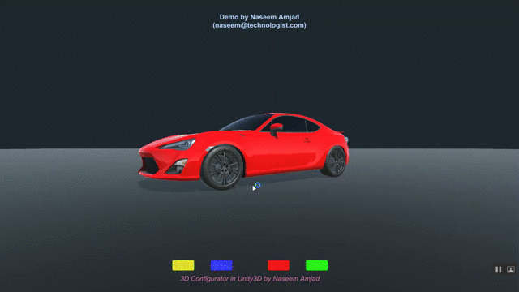

# Unity 3D Product (Car) Configurator
An example in Unity3D of how to change color of a car (i.e. change its configuration).

Uses Unity version 2020.3.1f1

## Demo

## Contact
You may contact author at naseem@technologist.com